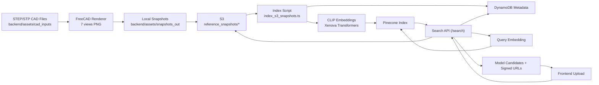

# Industrility Visual Part Search Prototype

## Project Overview
Industrility Visual Part Search Prototype is an end-to-end visual retrieval system for industrial parts. It allows a user to upload a part image (for example, a hook or valve photo), computes an image embedding, searches a vector index, and returns the closest CAD snapshot matches with confidence scores.

The system exists to reduce manual catalog lookup time in industrial workflows. Instead of searching by text keywords or part codes only, users can search from visual similarity. This is especially useful when operators have a photo from the field but do not know the exact part name.

The repository includes two core pipelines: (1) CAD snapshot ingestion and indexing, and (2) online search and result serving. STEP/STP CAD files are converted to standardized views, uploaded to S3, embedded with CLIP, indexed in Pinecone, and linked with metadata in DynamoDB.

The current implementation focuses on a practical local + AWS workflow with clear logs, reproducible scripts, and serverless-compatible backend handlers.

## Tech Stack
### Languages
- TypeScript (backend + frontend)
- Python (FreeCAD/Blender rendering helpers)
- JavaScript (Node scripts)

### Frontend
- Next.js `14.2.35`
- React `18.3.1`
- React DOM `18.3.1`
- TypeScript `^5.4.5`

### Backend
- Node.js runtime: `nodejs20.x` (Serverless config)
- Serverless Framework `^3.38.0`
- `serverless-offline` `^13.5.0`
- `serverless-plugin-typescript` `^2.1.5`
- AWS SDK v3:
  - `@aws-sdk/client-s3` `^3.606.0`
  - `@aws-sdk/client-dynamodb` `^3.606.0`
  - `@aws-sdk/lib-dynamodb` `^3.606.0`
  - `@aws-sdk/s3-request-presigner` `^3.606.0`
- Vector DB client: `@pinecone-database/pinecone` `^2.2.2`
- Embeddings model runtime: `@xenova/transformers` `^2.15.0`
- Multipart parsing: `busboy` `^1.6.0`
- Native image dependency: `canvas` `^2.11.2`

### CAD Rendering / Snapshot Tooling
- FreeCAD `1.0.x` (STEP/STP rendering path)
- Blender scripts exist, but STEP/STP flow currently uses FreeCAD renderer

### Infrastructure / Services
- AWS S3 (snapshot storage)
- AWS DynamoDB (metadata)
- Pinecone (vector index)
- AWS Lambda + API Gateway HTTP API via Serverless

### Python packaging file in repo
- `backend/requirements.txt`:
  - `pip>=23.0`
  - `setuptools>=65.0`
  - `wheel>=0.38`

## Key Features
### Core Features
- Upload image from UI and trigger visual part search
- Backend `/search` API with multipart upload support
- CLIP-based image embedding generation (`512` dimensions)
- Pinecone similarity query and ranked candidate retrieval
- DynamoDB metadata lookup and S3 signed URL generation
- STEP/STP ingestion pipeline:
  - recursive CAD scan
  - 7 standard views per part (`top`, `bottom`, `left`, `right`, `front`, `back`, `isometric`)
  - S3 upload under `reference_snapshots/<part_id>/<view>.png`
- S3 snapshot indexer script that writes both Pinecone vectors and DynamoDB metadata
- Detailed single-line timestamped backend logs
- Interactive UI feedback loop:
  - shows one model candidate group at a time initially
  - user can mark model as correct/incorrect
  - `No` reveals next candidate model while keeping previous candidates visible

### Nice-to-have / Future Improvements
- Better model accuracy via domain fine-tuning or multi-stage reranking
- Background segmentation / contour-first retrieval for shape-heavy matching
- Strict stale-vector cleanup and namespace lifecycle automation
- Caching for embeddings and presigned URLs
- Authn/Authz, rate limiting, and audit logging
- CI/CD, automated tests, and deployment environments

## Architecture & Flow
### End-to-End Flow
1. **CAD ingestion input**: STEP/STP files in `backend/assets/cad_inputs/`
2. **Snapshot generation**: FreeCAD script renders 7 orthographic/isometric views into `backend/assets/snapshots_out/<part_id>/`
3. **Object storage**: PNGs uploaded to S3 prefix `reference_snapshots/`
4. **Indexing**:
   - downloader reads PNGs from S3
   - CLIP embeddings generated
   - vectors upserted into Pinecone
   - metadata written to DynamoDB
5. **Online search**:
   - UI uploads query image to backend `/search`
   - query embedding generated
   - Pinecone top-K queried
   - candidates aggregated by model
   - metadata fetched from DynamoDB
   - signed S3 URLs returned to frontend
6. **Result feedback loop**:
   - UI displays candidate model views
   - user can accept or request next candidate

### Mermaid Diagram


## Repository Structure
```text
.
├── backend/
│   ├── assets/
│   │   ├── cad_inputs/                # Source CAD files (.step/.stp)
│   │   └── snapshots_out/             # Generated local PNG snapshots
│   ├── scripts/
│   │   └── setup_deps.js              # Dependency install helper with retries
│   ├── src/
│   │   ├── handlers/
│   │   │   ├── health.ts              # Health endpoint
│   │   │   └── search.ts              # Search endpoint + ranking/aggregation
│   │   ├── config/
│   │   │   └── env.ts                 # Env loading/validation (.env aware)
│   │   ├── providers/
│   │   │   ├── embedding/clipXenovaProvider.ts
│   │   │   ├── metadata/dynamodbProvider.ts
│   │   │   ├── storage/s3Provider.ts
│   │   │   └── vector/pineconeProvider.ts
│   │   ├── services/
│   │   │   ├── embeddingService.ts
│   │   │   ├── metadataService.ts
│   │   │   ├── pineconeService.ts
│   │   │   └── storageService.ts
│   │   ├── scripts/
│   │   │   ├── s3_snapshots_ingest.ts         # STEP/STP -> PNG -> S3
│   │   │   ├── index_s3_snapshots.ts          # S3 PNG -> embedding -> Pinecone + DynamoDB
│   │   │   ├── freecad_step_snapshot_renderer.py
│   │   ├── types/metadata.ts
│   │   └── utils/
│   │       ├── logger.ts              # Single-line IST timestamp logging
│   │       └── multipart.ts           # Multipart parser
│   ├── serverless.yml                 # Lambda/API/IAM resources
│   ├── package.json
│   ├── .env.example
│   └── README_S3_SNAPSHOTS.md
├── frontend/
│   ├── pages/
│   │   ├── index.tsx                  # Main UI page and user flow
│   │   └── _app.tsx
│   ├── styles/globals.css             # UI styling
│   ├── scripts/
│   │   ├── dev_with_hint.js           # Dev startup helper
│   │   └── setup_deps.js
│   ├── package.json
│   └── .env.example
└── .gitignore
```

## Setup & Run Instructions
### Prerequisites
- Node.js `20.x` recommended
- npm `10.x`+
- AWS CLI configured (`aws configure`)
- FreeCAD installed (for STEP/STP rendering)
- Pinecone project/index available

### 1) Clone and install
```bash
# root
cd backend
npm install

cd ../frontend
npm install
```

### 2) Configure environment
#### Backend: `backend/.env`
```env
AWS_REGION=<aws-region>
S3_BUCKET_NAME=<your-s3-bucket-name>
DYNAMODB_TABLE_NAME=<your-dynamodb-table-name>
PINECONE_API_KEY=YOUR_PINECONE_API_KEY
PINECONE_INDEX=<your-pinecone-index-name>
PINECONE_NAMESPACE=<your-pinecone-namespace>
SEARCH_MIN_SCORE=0.72
```

#### Frontend: `frontend/.env.local`
```env
NEXT_PUBLIC_API_BASE_URL=http://localhost:3001
```

### 3) Generate and upload snapshots
```bash
cd backend
npm run ingest:s3-snapshots -- --input_dir ./assets/cad_inputs --output_dir ./assets/snapshots_out --size 512 --concurrency 1
```

Dry run (no upload):
```bash
npm run ingest:s3-snapshots -- --dry_run --input_dir ./assets/cad_inputs --output_dir ./assets/snapshots_out --size 512 --concurrency 1
```

### 4) Index snapshots (Pinecone + DynamoDB)
```bash
cd backend
npm run index:s3-snapshots -- --prefix reference_snapshots/ --concurrency 1
```

Dry run:
```bash
npm run index:s3-snapshots -- --prefix reference_snapshots/ --concurrency 1 --dry_run
```

### 5) Run backend
```bash
cd backend
npm run offline
```
- Health check: `http://localhost:3001/health`

### 6) Run frontend
```bash
cd frontend
npm run dev
```
- UI: `http://localhost:3000`

### Build/Deploy commands
```bash
# frontend
cd frontend
npm run build
npm run start

# backend deploy
cd backend
npm run deploy
npm run remove
```

### Tests
There are currently no formal automated test scripts configured in `package.json`.

### Docker
No Dockerfile / docker-compose setup is currently present in this repository.

## Usage Guide
### UI Usage
1. Open `http://localhost:3000`
2. Upload/drag-drop an image
3. Click **Search**
4. Inspect candidate model views and scores
5. Use **Yes/No** feedback:
   - **Yes**: confirms model
   - **No**: reveals next candidate model while keeping previous candidates visible

### API Usage
#### Endpoint
- `POST /search`
- URL (local): `http://localhost:3001/search`
- Content type: `multipart/form-data`
- Field: `file`

#### Example request
```bash
curl.exe -X POST "http://localhost:3001/search" -F "file=@./backend/assets/snapshots_out/ball_bearing/isometric.png"
```

#### Example response (shape)
```json
{
  "matches": [
    {
      "id": "ball_bearing-isometric",
      "score": 0.8123,
      "model": "ball_bearing",
      "view": "isometric",
      "label": "ball_bearing - isometric view",
      "signedImageUrl": "https://..."
    }
  ],
  "modelCandidates": [
    {
      "partId": "ball_bearing",
      "model": "ball_bearing",
      "aggregateScore": 0.8123,
      "views": [
        { "id": "ball_bearing-top", "score": 0.78, "model": "ball_bearing", "view": "top", "label": "ball_bearing - top view", "signedImageUrl": "https://..." }
      ]
    }
  ],
  "request_id": "..."
}
```

### Where outputs are saved
- Local snapshots: `backend/assets/snapshots_out/<part_id>/<view>.png`
- S3 snapshots: `s3://<bucket>/reference_snapshots/<part_id>/<view>.png`
- DynamoDB metadata: table from `DYNAMODB_TABLE_NAME`
- Pinecone vectors: index/namespace from `PINECONE_INDEX`, `PINECONE_NAMESPACE`
- Backend logs: terminal output from `npm run offline` (single-line timestamp format)

## Snapshots / Images
No runtime screenshots are committed currently.
If needed, add submission screenshots under `assets/` or `frontend/public/` and reference them with relative paths in this section.

## Results
### Example observed indexing summary
```text
[INDEX SUMMARY]
- Keys scanned: 28
- Indexed: 28
- Skipped: 0
- Errors: 0
```

### Example search behavior
- Query upload is embedded with CLIP (`512` dims)
- Pinecone returns top-k vector matches
- Backend aggregates by model and returns model candidates

### Operational log format
From `backend/src/utils/logger.ts`:
```text
YYYY-MM-DD HH:mm:ss IST | LEVEL | requestId=<id> | <message>
```

## Assumptions & Limitations
- Current indexed dataset is small (few part families), so model confusion is expected.
- CLIP is a general-purpose embedding model; it is not fine-tuned for CAD part discrimination.
- Search quality is highly dependent on rendering consistency (camera, lighting, background).
- Stale vectors in Pinecone namespaces can pollute results unless namespaces are managed/cleaned.
- No automated tests and no CI pipeline yet.
- No Dockerized local environment currently.
- FreeCAD/graphics tooling behavior can vary across OS and installation paths.

## Future Work
- Add robust namespace/version management for re-index operations.
- Add reranking stage (shape-specific or learned ranker).
- Add image preprocessing (background removal / contour extraction).
- Add top-N model confidence calibration and threshold auto-tuning.
- Add backend unit/integration tests and frontend e2e tests.
- Add Docker-based local stack for reproducibility.
- Add authentication and request-level observability dashboards.
- Add incremental indexing and dedup checks.

## License / Credits
- No explicit project license file is currently present in this repository. Add `LICENSE` for distribution clarity.
- CAD model assets appear to be externally sourced; ensure compliance with original authors’ terms before production use.
- If using GrabCAD or similar repositories, include direct attribution links and usage permissions in this section.
- Embedding model runtime is based on `@xenova/transformers` and related upstream model licenses.
